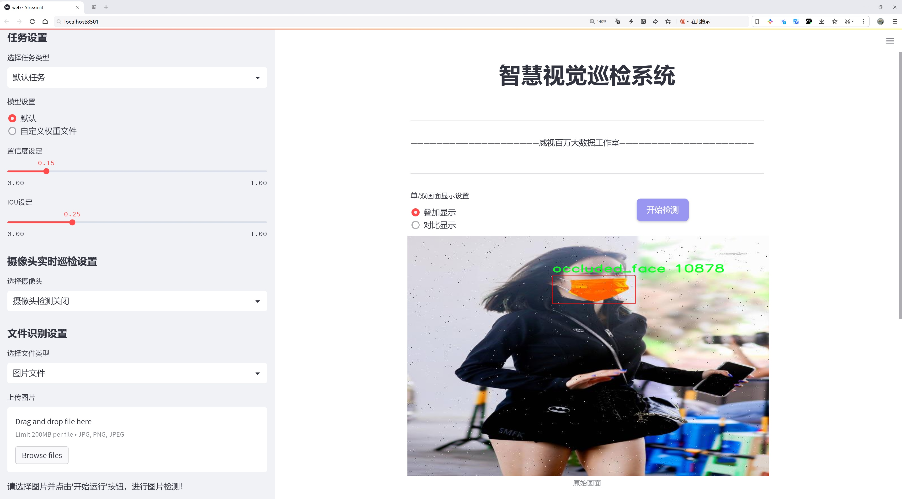
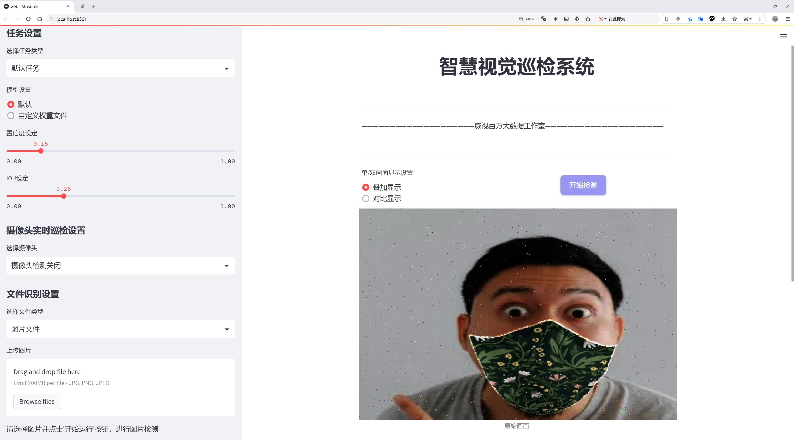
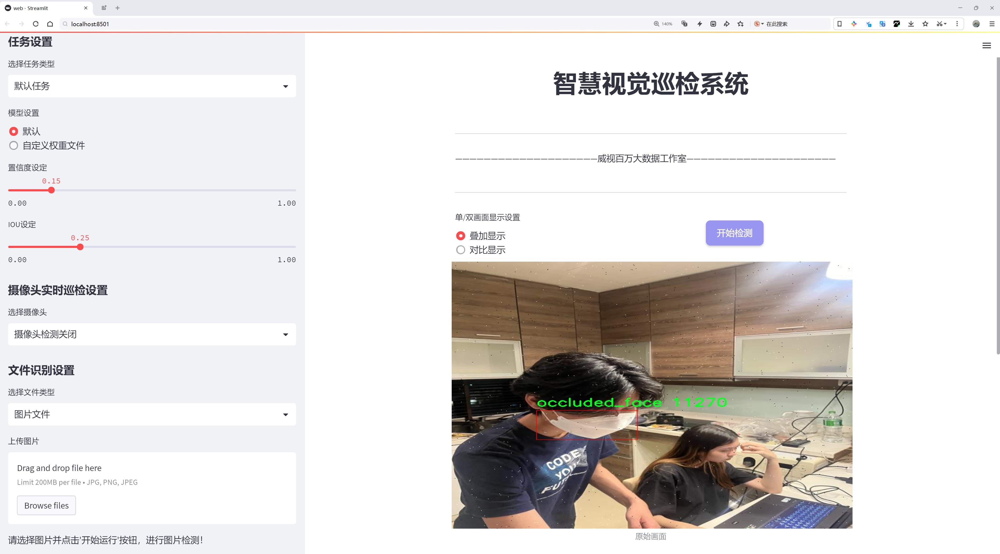
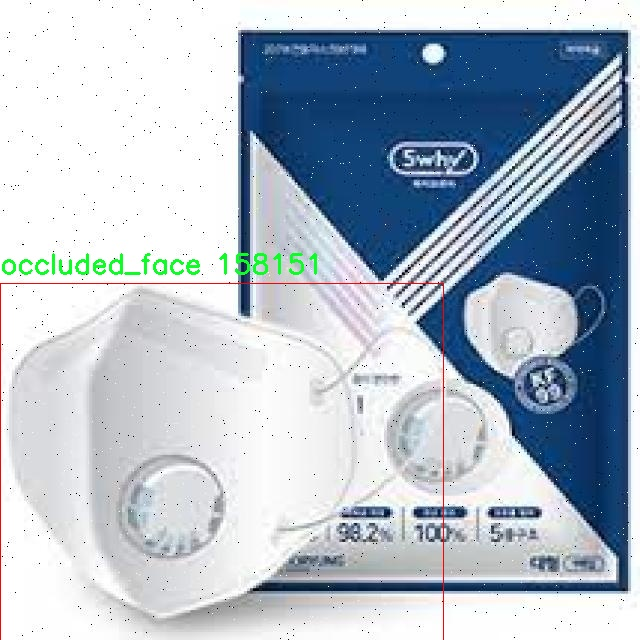
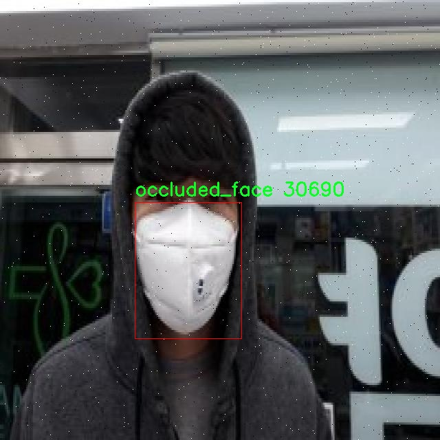
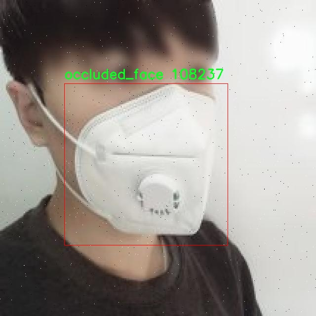

# 人脸遮挡检测检测系统源码分享
 # [一条龙教学YOLOV8标注好的数据集一键训练_70+全套改进创新点发刊_Web前端展示]

### 1.研究背景与意义

项目参考[AAAI Association for the Advancement of Artificial Intelligence](https://gitee.com/qunmasj/projects)

项目来源[AACV Association for the Advancement of Computer Vision](https://kdocs.cn/l/cszuIiCKVNis)

研究背景与意义

随着人工智能技术的迅猛发展，计算机视觉领域在物体检测、图像识别等方面取得了显著的进展。其中，人脸检测作为计算机视觉的重要应用之一，广泛应用于安防监控、智能家居、社交媒体等多个领域。然而，在实际应用中，人脸检测面临着诸多挑战，尤其是人脸遮挡问题。遮挡现象可能由多种因素引起，如佩戴口罩、遮挡物体、光照变化等，这些因素会显著降低人脸检测系统的准确性和鲁棒性。因此，研究一种高效、准确的人脸遮挡检测系统显得尤为重要。

本研究旨在基于改进的YOLOv8模型，构建一个高效的人脸遮挡检测系统。YOLO（You Only Look Once）系列模型因其实时性和高准确率而受到广泛关注。YOLOv8作为该系列的最新版本，进一步提升了检测精度和速度，适合于复杂场景下的人脸检测任务。通过对YOLOv8模型的改进，结合特定的遮挡检测算法，我们期望能够提高对遮挡人脸的识别能力，从而提升整体的人脸检测性能。

在本研究中，我们使用了一个包含1725张图像的数据集，该数据集分为两个类别：正常人脸和被遮挡的人脸。这一数据集的构建为研究提供了坚实的基础，涵盖了多种遮挡情况和不同的拍摄角度，使得模型能够在多样化的场景中进行训练和测试。通过对这两个类别的深入分析，我们能够更好地理解遮挡对人脸检测的影响，并探索有效的解决方案。

本研究的意义不仅在于提升人脸遮挡检测的准确性，更在于推动计算机视觉技术在实际应用中的落地。随着人脸识别技术的广泛应用，如何处理遮挡问题已成为行业内亟待解决的难题。通过改进YOLOv8模型，我们的研究将为人脸检测技术提供新的思路和方法，进而促进智能监控、身份验证等领域的应用发展。

此外，本研究还将为后续的研究提供重要的参考依据。遮挡检测不仅限于人脸领域，其方法和技术同样可以扩展到其他物体检测任务中。通过对遮挡现象的深入研究，我们能够为其他领域的物体检测提供借鉴，推动整个计算机视觉领域的进步。

综上所述，基于改进YOLOv8的人脸遮挡检测系统的研究具有重要的理论价值和实际意义。它不仅能够提升人脸检测的准确性和鲁棒性，还将为相关领域的技术发展提供新的视角和方法，推动人工智能技术的进一步应用与发展。

### 2.图片演示







##### 注意：由于此博客编辑较早，上面“2.图片演示”和“3.视频演示”展示的系统图片或者视频可能为老版本，新版本在老版本的基础上升级如下：（实际效果以升级的新版本为准）

  （1）适配了YOLOV8的“目标检测”模型和“实例分割”模型，通过加载相应的权重（.pt）文件即可自适应加载模型。

  （2）支持“图片识别”、“视频识别”、“摄像头实时识别”三种识别模式。

  （3）支持“图片识别”、“视频识别”、“摄像头实时识别”三种识别结果保存导出，解决手动导出（容易卡顿出现爆内存）存在的问题，识别完自动保存结果并导出到tempDir中。

  （4）支持Web前端系统中的标题、背景图等自定义修改，后面提供修改教程。

  另外本项目提供训练的数据集和训练教程,暂不提供权重文件（best.pt）,需要您按照教程进行训练后实现图片演示和Web前端界面演示的效果。

### 3.视频演示

[3.1 视频演示](https://www.bilibili.com/video/BV1bCtDe9ELb/)

### 4.数据集信息展示

##### 4.1 本项目数据集详细数据（类别数＆类别名）

nc: 2
names: ['face', 'occluded_face']


##### 4.2 本项目数据集信息介绍

数据集信息展示

在本研究中，我们使用了名为“occlusion check”的数据集，以训练和改进YOLOv8的人脸遮挡检测系统。该数据集专门设计用于解决人脸识别和检测领域中的一个重要挑战——人脸遮挡。随着计算机视觉技术的快速发展，尤其是在安全监控、智能交通和人机交互等应用场景中，准确识别和检测被遮挡的人脸变得愈发重要。因此，构建一个高质量的训练数据集对于提升模型的性能至关重要。

“occlusion check”数据集包含两类主要对象，分别为“face”和“occluded_face”。其中，“face”类代表清晰可见的人脸图像，而“occluded_face”类则包含部分被遮挡的人脸图像。这种分类方式使得模型能够学习到在不同遮挡条件下人脸的特征，进而提高其在复杂环境中的识别能力。遮挡的形式多种多样，可能是由于佩戴口罩、遮阳帽、手部遮挡或其他物体的干扰，这些因素都可能影响人脸识别的准确性。因此，数据集中包含的多样化样本对于训练一个鲁棒的检测系统至关重要。

数据集的构建过程经过精心设计，确保了样本的多样性和代表性。每一类样本均经过标注，标注信息包括人脸的位置信息和遮挡情况，这为YOLOv8模型的训练提供了丰富的监督信号。数据集中的图像来源于多个不同的场景和环境，包括室内、室外、不同光照条件下的拍摄，确保模型在实际应用中能够适应各种变化。此外，数据集还考虑到了不同人种、性别和年龄段的人脸特征，使得模型的训练更加全面，能够有效应对现实世界中的多样性。

在训练过程中，我们采用了数据增强技术，以进一步提高模型的泛化能力。通过对图像进行旋转、缩放、裁剪、颜色调整等操作，生成更多的训练样本，从而提升模型在面对未知数据时的表现。这种策略不仅增加了数据集的有效样本数量，还使得模型能够更好地适应不同的遮挡情况。

在评估阶段，我们将使用标准的性能指标，如准确率、召回率和F1-score，对模型在“occlusion check”数据集上的表现进行全面评估。通过与其他基准模型的对比，我们希望能够验证改进后的YOLOv8在处理人脸遮挡检测任务中的优势，从而为后续的研究和应用提供参考。

总之，“occlusion check”数据集为改进YOLOv8的人脸遮挡检测系统提供了坚实的基础。通过精心设计的样本和多样化的训练策略，我们期望能够显著提升模型在复杂环境下的检测能力，为人脸识别技术的实际应用开辟新的可能性。








### 5.全套项目环境部署视频教程（零基础手把手教学）

[5.1 环境部署教程链接（零基础手把手教学）](https://www.ixigua.com/7404473917358506534?logTag=c807d0cbc21c0ef59de5)


[5.2 安装Python虚拟环境创建和依赖库安装视频教程链接（零基础手把手教学）](https://www.ixigua.com/7404474678003106304?logTag=1f1041108cd1f708b01a)

### 6.手把手YOLOV8训练视频教程（零基础小白有手就能学会）

[6.1 手把手YOLOV8训练视频教程（零基础小白有手就能学会）](https://www.ixigua.com/7404477157818401292?logTag=d31a2dfd1983c9668658)

### 7.70+种全套YOLOV8创新点代码加载调参视频教程（一键加载写好的改进模型的配置文件）

[7.1 70+种全套YOLOV8创新点代码加载调参视频教程（一键加载写好的改进模型的配置文件）](https://www.ixigua.com/7404478314661806627?logTag=29066f8288e3f4eea3a4)

### 8.70+种全套YOLOV8创新点原理讲解（非科班也可以轻松写刊发刊，V10版本正在科研待更新）

由于篇幅限制，每个创新点的具体原理讲解就不一一展开，具体见下列网址中的创新点对应子项目的技术原理博客网址【Blog】：


[8.1 70+种全套YOLOV8创新点原理讲解链接](https://gitee.com/qunmasj/good)

### 9.系统功能展示（检测对象为举例，实际内容以本项目数据集为准）

图9.1.系统支持检测结果表格显示

  图9.2.系统支持置信度和IOU阈值手动调节

  图9.3.系统支持自定义加载权重文件best.pt(需要你通过步骤5中训练获得)

  图9.4.系统支持摄像头实时识别

  图9.5.系统支持图片识别

  图9.6.系统支持视频识别

  图9.7.系统支持识别结果文件自动保存

  图9.8.系统支持Excel导出检测结果数据


### 10.原始YOLOV8算法原理

原始YOLOv8算法原理

YOLOv8是Ultralytics团队在YOLOv5的基础上，经过近两年半的实际验证与改进而推出的最新目标检测模型。该模型不仅在结构上进行了优化，还在性能上实现了显著提升。YOLOv8的设计理念依然遵循YOLO系列的核心思想，即实时性与准确性的平衡，但在实现方式上进行了多项创新。

首先，YOLOv8在输入端的处理上进行了改进。以往的Mosaic数据增强虽然在一定程度上提高了模型的鲁棒性和泛化能力，但也可能破坏数据的真实分布，导致模型学习到一些不必要的噪声信息。因此，YOLOv8在训练的最后10个epoch中停止使用Mosaic数据增强，以确保模型在接近真实场景的条件下进行训练。这一策略的实施，旨在提升模型对真实数据的适应性和准确性。

在网络结构方面，YOLOv8的主干网络进行了重要的调整。具体来说，YOLOv8将原有的C3模块替换为C2f模块。C2f模块借鉴了YOLOv7中的ELAN（Efficient Layer Aggregation Network）思想，增加了更多的跳层连接，这种设计不仅增强了梯度流的丰富性，还保证了模型的轻量化。C2f模块通过多分支的跨层连接，提升了特征表示能力，使得模型在特征提取时能够更好地捕捉到细节信息。此外，YOLOv8依然保留了SPPF（Spatial Pyramid Pooling Fusion）结构，确保在效果不变的情况下，减少了该模块的执行时间。

在颈部网络的设计上，YOLOv8同样采用了C2f模块，并且在上采样之前删除了两处卷积连接层。这一改动使得特征融合过程更加高效，有助于不同尺度特征的整合，从而提升模型对多尺度目标的检测能力。YOLOv8的颈部网络采用了路径聚合网络（PAN）结构，这一结构在特征融合方面表现出色，能够有效地增强网络对不同缩放尺度对象的特征融合能力。

头部网络的设计是YOLOv8的一大亮点。YOLOv8采用了解耦头的结构，将分类和定位任务分开处理。这种设计思路源于YOLOX，旨在提高模型的收敛速度和预测精度。分类任务更关注特征图中提取到的特征与已有类别的相似性，而定位任务则关注边界框与真实框之间的关系。通过使用两个独立的检测头，YOLOv8能够更有效地优化分类和定位的损失函数，从而实现更高的检测精度。

YOLOv8还引入了无锚框结构，直接预测目标的中心位置，并使用任务对齐学习（Task Alignment Learning, TAL）来区分正负样本。通过引入分类分数和IOU的高次幂乘积作为衡量任务对齐程度的指标，YOLOv8在分类和定位损失函数中实现了更为精准的优化。这一创新使得模型在处理复杂场景时，能够更好地平衡定位精度与分类准确性。

在模型的检测性能上，YOLOv8展现出了优越的能力。根据官方在COCO数据集上的测试结果，YOLOv8在不同尺寸下的模型中，尽管参数量没有显著增加，但在精度上却超越了其他同类模型。同时，YOLOv8在推理速度上也表现出色，能够在保持高精度的前提下，实现更快的检测速度。这些特性使得YOLOv8在实际应用中，尤其是在需要实时检测的场景下，展现出了极大的潜力。

综合来看，YOLOv8模型的设计充分考虑了目标检测任务的实际需求，尤其是在实时性和准确性之间的平衡。尽管YOLOv8是一个新近推出的模型，但其在结构上的创新和性能上的提升，使其在目标检测领域具有重要的研究和应用价值。特别是在需要高效处理复杂场景的任务中，YOLOv8无疑是一个值得关注的选择。通过对YOLOv8的深入研究与应用，未来有望在多个领域实现更为广泛的应用，为智能视觉系统的发展提供强有力的支持。


### 11.项目核心源码讲解（再也不用担心看不懂代码逻辑）

#### 11.1 ui.py

以下是经过简化和注释的核心代码部分：

```python
import sys
import subprocess
from QtFusion.path import abs_path

def run_script(script_path):
    """
    使用当前 Python 环境运行指定的脚本。

    Args:
        script_path (str): 要运行的脚本路径
    """
    # 获取当前 Python 解释器的路径
    python_path = sys.executable

    # 构建运行命令，使用 streamlit 运行指定的脚本
    command = f'"{python_path}" -m streamlit run "{script_path}"'

    # 执行命令并等待其完成
    result = subprocess.run(command, shell=True)
    
    # 检查命令执行结果，如果返回码不为0，表示出错
    if result.returncode != 0:
        print("脚本运行出错。")

# 主程序入口
if __name__ == "__main__":
    # 获取要运行的脚本的绝对路径
    script_path = abs_path("web.py")

    # 调用函数运行脚本
    run_script(script_path)
```

### 代码注释说明：
1. **导入模块**：
   - `sys`：用于获取当前 Python 解释器的路径。
   - `subprocess`：用于执行外部命令。
   - `abs_path`：从 `QtFusion.path` 导入的函数，用于获取文件的绝对路径。

2. **`run_script` 函数**：
   - 该函数接受一个脚本路径作为参数，并使用当前 Python 环境运行该脚本。
   - 使用 `sys.executable` 获取当前 Python 解释器的路径。
   - 构建一个命令字符串，用于通过 `streamlit` 运行指定的脚本。
   - 使用 `subprocess.run` 执行命令，并检查返回码以判断脚本是否成功运行。

3. **主程序入口**：
   - 在 `if __name__ == "__main__":` 块中，首先获取要运行的脚本的绝对路径。
   - 然后调用 `run_script` 函数来执行该脚本。

这个文件名为 `ui.py`，其主要功能是通过当前的 Python 环境来运行一个指定的脚本，具体是一个名为 `web.py` 的文件。首先，文件导入了几个必要的模块，包括 `sys`、`os` 和 `subprocess`，这些模块提供了与系统交互的功能。

在 `run_script` 函数中，首先获取当前 Python 解释器的路径，这样可以确保使用正确的 Python 环境来执行脚本。接着，构建一个命令字符串，该命令使用 `streamlit` 来运行指定的脚本。`streamlit` 是一个用于构建数据应用的框架，因此这里的 `web.py` 很可能是一个使用 `streamlit` 编写的应用。

然后，使用 `subprocess.run` 方法来执行构建好的命令。这个方法会在一个新的进程中运行命令，并等待其完成。如果命令执行的返回码不为零，表示脚本运行过程中出现了错误，此时会打印出一条错误信息。

在文件的最后部分，使用 `if __name__ == "__main__":` 语句来确保只有在直接运行这个文件时才会执行下面的代码。这部分代码指定了要运行的脚本路径（通过调用 `abs_path` 函数获取 `web.py` 的绝对路径），然后调用 `run_script` 函数来执行这个脚本。

总体来看，这个文件的功能是作为一个启动器，方便用户通过命令行来运行一个基于 `streamlit` 的 Python 脚本。

#### 11.2 code\ultralytics\utils\ops.py

以下是经过简化并注释的核心代码部分：

```python
import torch
import numpy as np
import torchvision

def non_max_suppression(
    prediction,
    conf_thres=0.25,
    iou_thres=0.45,
    classes=None,
    max_det=300,
):
    """
    对一组边界框执行非最大抑制（NMS），以消除重叠的框。

    Args:
        prediction (torch.Tensor): 预测的边界框，形状为 (batch_size, num_classes + 4, num_boxes)。
        conf_thres (float): 置信度阈值，低于该值的框将被过滤。
        iou_thres (float): IoU阈值，低于该值的框在NMS期间将被过滤。
        classes (List[int]): 要考虑的类索引列表。如果为None，则考虑所有类。
        max_det (int): NMS后要保留的最大框数。

    Returns:
        List[torch.Tensor]: 每个图像的保留框的列表，形状为 (num_boxes, 6)。
    """
    # 检查置信度和IoU阈值的有效性
    assert 0 <= conf_thres <= 1, f"Invalid Confidence threshold {conf_thres}, valid values are between 0.0 and 1.0"
    assert 0 <= iou_thres <= 1, f"Invalid IoU {iou_thres}, valid values are between 0.0 and 1.0"

    bs = prediction.shape[0]  # 批大小
    nc = prediction.shape[1] - 4  # 类别数量
    xc = prediction[:, 4:5].amax(1) > conf_thres  # 置信度候选框

    output = [torch.zeros((0, 6), device=prediction.device)] * bs  # 初始化输出

    for xi, x in enumerate(prediction):  # 遍历每个图像的预测
        x = x[xc[xi]]  # 仅保留置信度高的框

        if not x.shape[0]:  # 如果没有框，继续下一个图像
            continue

        # 获取边界框和类别
        box, cls = x.split((4, nc), 1)

        # 仅保留最大置信度的类别
        conf, j = cls.max(1, keepdim=True)
        x = torch.cat((box, conf, j.float()), 1)[conf.view(-1) > conf_thres]

        # 按类别过滤
        if classes is not None:
            x = x[(x[:, 5:6] == torch.tensor(classes, device=x.device)).any(1)]

        n = x.shape[0]  # 当前图像的框数量
        if not n:  # 如果没有框，继续下一个图像
            continue
        if n > max_det:  # 如果框数量超过最大限制，按置信度排序并保留前max_det个框
            x = x[x[:, 4].argsort(descending=True)[:max_det]]

        # 执行NMS
        boxes = x[:, :4]  # 获取边界框
        scores = x[:, 4]  # 获取置信度
        i = torchvision.ops.nms(boxes, scores, iou_thres)  # 使用torchvision的NMS
        output[xi] = x[i]  # 保存NMS后的框

    return output  # 返回每个图像的保留框
```

### 代码说明：
1. **non_max_suppression 函数**：该函数实现了非最大抑制（NMS）算法，用于处理目标检测中的重叠边界框问题。它通过置信度和IoU阈值来过滤和选择最佳的边界框。

2. **参数说明**：
   - `prediction`：包含预测边界框和类别信息的张量。
   - `conf_thres`：置信度阈值，低于该值的框将被排除。
   - `iou_thres`：IoU阈值，用于判断框之间的重叠程度。
   - `classes`：指定要考虑的类别。
   - `max_det`：NMS后要保留的最大框数。

3. **输出**：返回一个列表，其中每个元素是一个张量，包含经过NMS处理后的边界框信息。每个张量的形状为 (num_boxes, 6)，包括边界框坐标和置信度。

这个程序文件 `ops.py` 是 Ultralytics YOLO（You Only Look Once）模型的一部分，主要包含了一些用于处理图像和目标检测的实用函数。文件中包含了多个类和函数，下面对其进行逐一说明。

首先，文件定义了一个 `Profile` 类，用于性能分析。它可以作为装饰器或上下文管理器使用，能够记录代码块的执行时间。初始化时可以设置初始时间和设备（如 CPU 或 GPU），在进入上下文时开始计时，退出时停止计时并返回经过的时间。

接下来，文件中有多个函数用于处理边界框和图像坐标。`segment2box` 函数将分割标签转换为边界框标签，确保坐标在图像内部。`scale_boxes` 函数用于根据不同图像的尺寸调整边界框的大小。`make_divisible` 函数返回一个最接近的可以被指定除数整除的数。

`nms_rotated` 和 `non_max_suppression` 函数实现了非极大值抑制（NMS），用于过滤重叠的边界框，保留最有可能的检测结果。`clip_boxes` 和 `clip_coords` 函数则用于将边界框和坐标限制在图像边界内。

还有一些函数用于坐标格式的转换，例如 `xyxy2xywh` 和 `xywh2xyxy`，分别用于在不同的边界框表示法之间转换。`xywhn2xyxy` 和 `xyxy2xywhn` 函数则处理归一化的边界框坐标。

此外，文件中还定义了一些与掩膜处理相关的函数，如 `process_mask` 和 `process_mask_upsample`，用于将掩膜应用于边界框并进行上采样。

最后，文件包含了一些辅助函数，如 `convert_torch2numpy_batch` 用于将 PyTorch 张量转换为 NumPy 数组，以及 `clean_str` 用于清理字符串中的特殊字符。

整体来看，这个文件提供了许多用于目标检测和图像处理的实用工具函数，支持 YOLO 模型的训练和推理过程。

#### 11.3 code\ultralytics\engine\results.py

以下是经过简化和注释的核心代码部分，主要包括 `BaseTensor` 和 `Results` 类。这些类用于处理推理结果，包括边界框、掩码、关键点等。

```python
import numpy as np
import torch

class BaseTensor:
    """基础张量类，提供简化的张量操作和设备管理方法。"""

    def __init__(self, data, orig_shape) -> None:
        """
        初始化 BaseTensor 类。

        参数:
            data (torch.Tensor | np.ndarray): 预测结果，如边界框、掩码和关键点。
            orig_shape (tuple): 原始图像的形状。
        """
        assert isinstance(data, (torch.Tensor, np.ndarray))  # 确保数据类型正确
        self.data = data  # 存储数据
        self.orig_shape = orig_shape  # 存储原始形状

    @property
    def shape(self):
        """返回数据张量的形状。"""
        return self.data.shape

    def cpu(self):
        """返回一个在 CPU 内存上的张量副本。"""
        return self if isinstance(self.data, np.ndarray) else self.__class__(self.data.cpu(), self.orig_shape)

    def numpy(self):
        """返回一个作为 numpy 数组的张量副本。"""
        return self if isinstance(self.data, np.ndarray) else self.__class__(self.data.numpy(), self.orig_shape)

    def cuda(self):
        """返回一个在 GPU 内存上的张量副本。"""
        return self.__class__(torch.as_tensor(self.data).cuda(), self.orig_shape)

    def to(self, *args, **kwargs):
        """返回一个在指定设备和数据类型上的张量副本。"""
        return self.__class__(torch.as_tensor(self.data).to(*args, **kwargs), self.orig_shape)

    def __len__(self):
        """返回数据张量的长度。"""
        return len(self.data)

    def __getitem__(self, idx):
        """返回指定索引的数据张量副本。"""
        return self.__class__(self.data[idx], self.orig_shape)


class Results:
    """
    存储和操作推理结果的类。

    参数:
        orig_img (numpy.ndarray): 原始图像的 numpy 数组。
        path (str): 图像文件的路径。
        names (dict): 类名字典。
        boxes (torch.tensor, optional): 每个检测的边界框坐标的 2D 张量。
        masks (torch.tensor, optional): 检测掩码的 3D 张量，每个掩码是一个二进制图像。
        probs (torch.tensor, optional): 每个类的概率的 1D 张量。
        keypoints (List[List[float]], optional): 每个对象的检测关键点列表。
    """

    def __init__(self, orig_img, path, names, boxes=None, masks=None, probs=None, keypoints=None) -> None:
        """初始化 Results 类。"""
        self.orig_img = orig_img  # 存储原始图像
        self.orig_shape = orig_img.shape[:2]  # 存储原始图像的形状
        self.boxes = Boxes(boxes, self.orig_shape) if boxes is not None else None  # 存储边界框
        self.masks = Masks(masks, self.orig_shape) if masks is not None else None  # 存储掩码
        self.probs = Probs(probs) if probs is not None else None  # 存储概率
        self.keypoints = Keypoints(keypoints, self.orig_shape) if keypoints is not None else None  # 存储关键点
        self.names = names  # 存储类名
        self.path = path  # 存储图像路径

    def __getitem__(self, idx):
        """返回指定索引的 Results 对象。"""
        return self._apply("__getitem__", idx)

    def __len__(self):
        """返回 Results 对象中的检测数量。"""
        for k in ["boxes", "masks", "probs", "keypoints"]:
            v = getattr(self, k)
            if v is not None:
                return len(v)

    def update(self, boxes=None, masks=None, probs=None):
        """更新 Results 对象的 boxes、masks 和 probs 属性。"""
        if boxes is not None:
            self.boxes = Boxes(boxes, self.orig_shape)
        if masks is not None:
            self.masks = Masks(masks, self.orig_shape)
        if probs is not None:
            self.probs = probs

    def _apply(self, fn, *args, **kwargs):
        """
        将指定函数应用于所有非空属性，并返回一个新的 Results 对象。

        参数:
            fn (str): 要应用的函数名称。
            *args: 传递给函数的可变参数。
            **kwargs: 传递给函数的关键字参数。

        返回:
            Results: 一个新的 Results 对象，属性被修改。
        """
        r = self.new()
        for k in ["boxes", "masks", "probs", "keypoints"]:
            v = getattr(self, k)
            if v is not None:
                setattr(r, k, getattr(v, fn)(*args, **kwargs))
        return r

    def cpu(self):
        """返回一个所有张量在 CPU 内存上的 Results 对象副本。"""
        return self._apply("cpu")

    def numpy(self):
        """返回一个所有张量作为 numpy 数组的 Results 对象副本。"""
        return self._apply("numpy")

    def cuda(self):
        """返回一个所有张量在 GPU 内存上的 Results 对象副本。"""
        return self._apply("cuda")

    def to(self, *args, **kwargs):
        """返回一个在指定设备和数据类型上的 Results 对象副本。"""
        return self._apply("to", *args, **kwargs)

    def new(self):
        """返回一个新的 Results 对象，具有相同的图像、路径和类名。"""
        return Results(orig_img=self.orig_img, path=self.path, names=self.names)

    def plot(self, conf=True, boxes=True, masks=True):
        """
        在输入图像上绘制检测结果。

        参数:
            conf (bool): 是否绘制检测置信度分数。
            boxes (bool): 是否绘制边界框。
            masks (bool): 是否绘制掩码。

        返回:
            (numpy.ndarray): 带注释的图像的 numpy 数组。
        """
        # 这里省略具体的绘图实现
        pass
```

### 代码说明
1. **BaseTensor 类**：提供了对张量的基本操作，包括在 CPU 和 GPU 之间的转换、获取张量的形状等。
2. **Results 类**：用于存储推理结果，包括原始图像、边界框、掩码、概率和关键点等。它提供了更新和获取这些结果的方法，以及绘制检测结果的功能。

这些类是进行目标检测和图像处理的基础，支持多种操作和数据格式的转换。

这个程序文件主要定义了用于处理推理结果的类和方法，特别是与目标检测相关的结果，如边界框、掩膜、关键点和分类概率等。文件的核心是 `Results` 类及其相关的子类，这些类提供了方便的接口来操作和可视化推理结果。

首先，`BaseTensor` 类是一个基础类，封装了对张量的基本操作，包括在 CPU 和 GPU 之间的转换、将张量转换为 NumPy 数组等。它还实现了索引和长度的支持，使得可以像列表一样访问数据。

`Results` 类是主要的结果存储和操作类。它接受原始图像、文件路径、类别名称以及可选的边界框、掩膜、概率和关键点等信息。该类提供了更新结果、获取结果长度、索引访问等功能。它还包含用于绘制检测结果的 `plot` 方法，可以在输入图像上绘制边界框、掩膜和关键点，并返回带注释的图像。

在 `Results` 类中，`Boxes`、`Masks`、`Keypoints` 和 `Probs` 类分别用于处理边界框、掩膜、关键点和分类概率。每个类都继承自 `BaseTensor`，并提供特定的属性和方法。例如，`Boxes` 类提供了获取边界框坐标、置信度和类别的属性，`Masks` 类则提供了获取掩膜的像素坐标和归一化坐标的方法。

此外，`Results` 类还提供了将结果保存为文本文件、裁剪图像、转换为 JSON 格式等功能。这些功能使得用户可以方便地保存和共享推理结果。

整体而言，这个文件为目标检测模型的推理结果提供了一个结构化的处理框架，便于用户进行后续分析和可视化。

#### 11.4 train.py

以下是经过简化和注释的核心代码部分，主要关注于YOLO检测模型的训练过程：

```python
import random
import numpy as np
import torch.nn as nn
from ultralytics.data import build_dataloader, build_yolo_dataset
from ultralytics.engine.trainer import BaseTrainer
from ultralytics.models import yolo
from ultralytics.nn.tasks import DetectionModel
from ultralytics.utils import LOGGER, RANK
from ultralytics.utils.torch_utils import de_parallel, torch_distributed_zero_first

class DetectionTrainer(BaseTrainer):
    """
    DetectionTrainer类用于基于YOLO模型进行目标检测的训练。
    """

    def build_dataset(self, img_path, mode="train", batch=None):
        """
        构建YOLO数据集。

        参数:
            img_path (str): 图像文件夹的路径。
            mode (str): 模式，可以是'train'或'val'，用于不同的数据增强。
            batch (int, optional): 批量大小，仅用于'rect'模式。
        """
        gs = max(int(de_parallel(self.model).stride.max() if self.model else 0), 32)  # 获取模型的最大步幅
        return build_yolo_dataset(self.args, img_path, batch, self.data, mode=mode, rect=mode == "val", stride=gs)

    def get_dataloader(self, dataset_path, batch_size=16, rank=0, mode="train"):
        """构建并返回数据加载器。"""
        assert mode in ["train", "val"]  # 确保模式有效
        with torch_distributed_zero_first(rank):  # 在分布式训练中，确保数据集只初始化一次
            dataset = self.build_dataset(dataset_path, mode, batch_size)
        shuffle = mode == "train"  # 训练模式下打乱数据
        workers = self.args.workers if mode == "train" else self.args.workers * 2  # 设置工作线程数
        return build_dataloader(dataset, batch_size, workers, shuffle, rank)  # 返回数据加载器

    def preprocess_batch(self, batch):
        """对图像批次进行预处理，包括缩放和转换为浮点数。"""
        batch["img"] = batch["img"].to(self.device, non_blocking=True).float() / 255  # 将图像转换为浮点数并归一化
        if self.args.multi_scale:  # 如果启用多尺度训练
            imgs = batch["img"]
            sz = (
                random.randrange(self.args.imgsz * 0.5, self.args.imgsz * 1.5 + self.stride)
                // self.stride
                * self.stride
            )  # 随机选择新的图像大小
            sf = sz / max(imgs.shape[2:])  # 计算缩放因子
            if sf != 1:
                ns = [
                    math.ceil(x * sf / self.stride) * self.stride for x in imgs.shape[2:]
                ]  # 计算新的形状
                imgs = nn.functional.interpolate(imgs, size=ns, mode="bilinear", align_corners=False)  # 进行插值
            batch["img"] = imgs  # 更新批次图像
        return batch

    def get_model(self, cfg=None, weights=None, verbose=True):
        """返回YOLO检测模型。"""
        model = DetectionModel(cfg, nc=self.data["nc"], verbose=verbose and RANK == -1)  # 创建检测模型
        if weights:
            model.load(weights)  # 加载权重
        return model

    def plot_training_samples(self, batch, ni):
        """绘制训练样本及其标注。"""
        plot_images(
            images=batch["img"],
            batch_idx=batch["batch_idx"],
            cls=batch["cls"].squeeze(-1),
            bboxes=batch["bboxes"],
            paths=batch["im_file"],
            fname=self.save_dir / f"train_batch{ni}.jpg",
            on_plot=self.on_plot,
        )

    def plot_metrics(self):
        """从CSV文件中绘制指标。"""
        plot_results(file=self.csv, on_plot=self.on_plot)  # 保存结果图
```

### 代码注释说明：
1. **DetectionTrainer类**：继承自`BaseTrainer`，用于实现YOLO模型的训练。
2. **build_dataset方法**：根据输入的图像路径和模式构建YOLO数据集，支持训练和验证模式。
3. **get_dataloader方法**：构建数据加载器，支持分布式训练，并根据模式设置数据打乱。
4. **preprocess_batch方法**：对输入的图像批次进行预处理，包括归一化和可能的多尺度调整。
5. **get_model方法**：创建并返回YOLO检测模型，支持加载预训练权重。
6. **plot_training_samples方法**：绘制训练样本及其对应的标注信息。
7. **plot_metrics方法**：从CSV文件中绘制训练过程中的指标，便于可视化分析。

这个程序文件 `train.py` 是一个用于训练 YOLO（You Only Look Once）目标检测模型的 Python 脚本，属于 Ultralytics YOLO 框架的一部分。该文件主要定义了一个名为 `DetectionTrainer` 的类，继承自 `BaseTrainer`，并实现了一系列与目标检测训练相关的方法。

首先，文件导入了一些必要的库和模块，包括数学运算、随机数生成、深度学习相关的 PyTorch 模块，以及 Ultralytics 提供的数据处理、模型构建和训练工具。这些模块为后续的训练过程提供了基础支持。

`DetectionTrainer` 类中包含多个方法。`build_dataset` 方法用于构建 YOLO 数据集，接收图像路径、模式（训练或验证）和批量大小作为参数。它通过调用 `build_yolo_dataset` 函数来生成数据集，支持不同模式下的图像增强。

`get_dataloader` 方法用于构建数据加载器，确保在分布式训练时只初始化一次数据集，并根据训练或验证模式设置是否打乱数据顺序。它还根据模式选择合适的工作线程数。

`preprocess_batch` 方法对输入的图像批次进行预处理，包括将图像缩放到适当的大小并转换为浮点数格式。该方法支持多尺度训练，通过随机选择图像大小来增强模型的鲁棒性。

`set_model_attributes` 方法用于设置模型的属性，包括类别数量和类别名称，以便模型能够正确识别和分类目标。

`get_model` 方法返回一个 YOLO 检测模型实例，可以选择加载预训练权重。

`get_validator` 方法返回一个用于模型验证的 `DetectionValidator` 实例，便于在训练过程中监控模型的性能。

`label_loss_items` 方法用于返回一个包含训练损失项的字典，方便后续的损失监控和分析。

`progress_string` 方法生成一个格式化的字符串，显示训练进度，包括当前的 epoch、GPU 内存使用情况、损失值、实例数量和图像大小等信息。

`plot_training_samples` 方法用于绘制训练样本及其标注，帮助可视化训练过程中的数据。

最后，`plot_metrics` 和 `plot_training_labels` 方法分别用于绘制训练过程中的指标和标签，便于分析模型的训练效果和性能。

整体来看，这个文件提供了一个完整的框架，用于训练 YOLO 模型，涵盖了数据集构建、数据加载、模型设置、训练过程监控和结果可视化等多个方面，适合于目标检测任务的实现和优化。

#### 11.5 70+种YOLOv8算法改进源码大全和调试加载训练教程（非必要）\ultralytics\models\nas\__init__.py

以下是代码中最核心的部分，并附上详细的中文注释：

```python
# 导入必要的模块和类
from .model import NAS  # 从当前包的model模块中导入NAS类
from .predict import NASPredictor  # 从当前包的predict模块中导入NASPredictor类
from .val import NASValidator  # 从当前包的val模块中导入NASValidator类

# 定义模块的公开接口
__all__ = 'NASPredictor', 'NASValidator', 'NAS'  # 指定在使用from <module> import *时，公开的类和函数
```

### 注释说明：
1. **导入模块**：
   - `from .model import NAS`：这行代码从当前包的`model`模块中导入`NAS`类，`NAS`可能是一个神经网络架构或模型的定义。
   - `from .predict import NASPredictor`：这行代码从当前包的`predict`模块中导入`NASPredictor`类，`NASPredictor`可能用于对输入数据进行预测。
   - `from .val import NASValidator`：这行代码从当前包的`val`模块中导入`NASValidator`类，`NASValidator`可能用于验证模型的性能。

2. **定义公开接口**：
   - `__all__`是一个特殊变量，用于定义在使用`from <module> import *`时，哪些名称是可以被导入的。这里指定了`NASPredictor`、`NASValidator`和`NAS`，意味着这些类是模块的主要接口，用户可以直接使用它们。

这个程序文件是一个Python模块的初始化文件，通常用于定义模块的公共接口。在这个特定的文件中，主要涉及到Ultralytics YOLO（You Only Look Once）算法的一个改进版本，特别是与神经架构搜索（NAS, Neural Architecture Search）相关的功能。

首先，文件的开头有一行注释，指出该项目使用的是AGPL-3.0许可证，这意味着该代码是开源的，用户可以自由使用和修改，但需要遵循相应的许可证条款。

接下来，文件通过相对导入的方式引入了三个类：`NAS`、`NASPredictor`和`NASValidator`。这些类分别来自于同一模块下的不同文件。`NAS`类可能是实现神经架构搜索的核心功能，而`NASPredictor`和`NASValidator`则分别用于模型的预测和验证。

最后，`__all__`变量被定义为一个包含字符串的元组，列出了该模块公开的接口。这意味着当使用`from module import *`语句时，只会导入`NASPredictor`、`NASValidator`和`NAS`这三个类。这种做法有助于控制模块的可见性，避免不必要的内部实现细节被外部访问。

总的来说，这个文件是Ultralytics YOLO项目中与NAS相关功能的一个重要组成部分，负责模块的初始化和公共接口的定义。

#### 11.6 code\ultralytics\models\nas\__init__.py

以下是代码中最核心的部分，并附上详细的中文注释：

```python
# 导入所需的模块和类
from .model import NAS  # 从当前包的model模块中导入NAS类
from .predict import NASPredictor  # 从当前包的predict模块中导入NASPredictor类
from .val import NASValidator  # 从当前包的val模块中导入NASValidator类

# 定义模块的公开接口
__all__ = "NASPredictor", "NASValidator", "NAS"  # 指定在使用from module import *时，公开的类和函数
```

### 代码注释说明：
1. **导入模块**：
   - `from .model import NAS`：从当前包的`model`模块中导入`NAS`类，`NAS`可能是一个与神经架构搜索（Neural Architecture Search）相关的模型。
   - `from .predict import NASPredictor`：从当前包的`predict`模块中导入`NASPredictor`类，`NASPredictor`可能用于对输入数据进行预测。
   - `from .val import NASValidator`：从当前包的`val`模块中导入`NASValidator`类，`NASValidator`可能用于验证模型的性能。

2. **定义公开接口**：
   - `__all__`是一个特殊变量，用于定义在使用`from module import *`时，哪些名称是可以被导入的。在这里，`NASPredictor`、`NASValidator`和`NAS`被指定为公开接口，意味着它们是该模块的主要功能部分，用户可以直接使用这些类。

这个程序文件是Ultralytics YOLO项目中的一个初始化文件，文件名为`__init__.py`，它的主要作用是定义模块的公共接口。在这个文件中，首先引入了三个类：`NAS`、`NASPredictor`和`NASValidator`，它们分别来自于同一目录下的`model`、`predict`和`val`模块。

`NAS`类可能是与神经架构搜索（Neural Architecture Search）相关的模型类，负责定义和管理YOLO模型的结构和参数。`NASPredictor`类则可能用于进行预测，处理输入数据并返回模型的预测结果。`NASValidator`类则用于验证模型的性能，可能涉及到模型评估和测试的相关功能。

在文件的最后，使用`__all__`变量定义了模块的公共接口，指定了在使用`from module import *`时，哪些类会被导入。这里列出的类是`NASPredictor`、`NASValidator`和`NAS`，这意味着当其他模块导入这个包时，只能访问这三个类，增强了模块的封装性和可维护性。

整体来看，这个文件是Ultralytics YOLO项目中一个重要的组成部分，负责组织和暴露与神经架构搜索相关的功能。

### 12.系统整体结构（节选）

### 整体功能和构架概括

Ultralytics YOLO项目是一个用于目标检测的深度学习框架，提供了多种YOLO模型的实现和训练工具。该项目的整体功能包括数据处理、模型训练、推理结果处理、可视化以及模型评估等。通过模块化的设计，项目将不同的功能分散到多个文件中，以便于维护和扩展。

- **数据处理**：包括数据集的构建和加载，图像预处理等。
- **模型训练**：提供训练过程的控制、损失计算、指标监控等功能。
- **推理结果处理**：处理模型的输出结果，包括边界框、掩膜和关键点等。
- **可视化**：支持绘制训练样本、结果图像等，便于分析和调试。
- **神经架构搜索**：实现了NAS相关的功能，优化模型结构。

### 文件功能整理表

| 文件路径                                                                                   | 功能描述                                                                                           |
|------------------------------------------------------------------------------------------|---------------------------------------------------------------------------------------------------|
| `D:\tools\20240809\code\ui.py`                                                          | 作为启动器，运行指定的 `web.py` 脚本，方便用户通过命令行启动基于 Streamlit 的应用。              |
| `D:\tools\20240809\code\code\ultralytics\utils\ops.py`                                 | 提供图像处理和目标检测的实用函数，包括边界框处理、非极大值抑制、坐标转换等。                    |
| `D:\tools\20240809\code\code\ultralytics\engine\results.py`                           | 定义处理推理结果的类和方法，支持边界框、掩膜、关键点的存储和可视化。                            |
| `D:\tools\20240809\code\train.py`                                                       | 实现YOLO模型的训练过程，包括数据集构建、数据加载、模型设置和训练监控等功能。                  |
| `D:\tools\20240809\code\70+种YOLOv8算法改进源码大全和调试加载训练教程（非必要）\ultralytics\models\nas\__init__.py` | 初始化NAS模块，定义公共接口，导入与神经架构搜索相关的类。                                       |
| `D:\tools\20240809\code\code\ultralytics\models\nas\__init__.py`                      | 初始化NAS模块，定义公共接口，导入与神经架构搜索相关的类。                                       |
| `D:\tools\20240809\code\ultralytics\utils\callbacks\mlflow.py`                        | 集成MLflow用于模型训练过程中的实验跟踪和管理，记录训练参数和结果。                              |
| `D:\tools\20240809\code\ultralytics\nn\__init__.py`                                   | 初始化神经网络模块，定义公共接口，导入与神经网络相关的类和功能。                               |
| `D:\tools\20240809\code\70+种YOLOv8算法改进源码大全和调试加载训练教程（非必要）\ultralytics\models\sam\modules\encoders.py` | 实现特定的编码器模块，可能用于图像特征提取或处理。                                              |
| `D:\tools\20240809\code\70+种YOLOv8算法改进源码大全和调试加载训练教程（非必要）\ultralytics\utils\autobatch.py` | 实现自动批处理功能，优化数据加载和训练过程中的批处理效率。                                      |
| `D:\tools\20240809\code\ultralytics\trackers\byte_tracker.py`                          | 实现目标跟踪功能，可能用于在视频流中跟踪检测到的目标。                                          |
| `D:\tools\20240809\code\70+种YOLOv8算法改进源码大全和调试加载训练教程（非必要）\ultralytics\utils\callbacks\clearml.py` | 集成ClearML用于模型训练过程中的实验跟踪和管理，记录训练参数和结果。                            |
| `D:\tools\20240809\code\ultralytics\nn\modules\utils.py`                               | 提供神经网络模块的辅助功能，可能包括模型构建、参数初始化等工具函数。                            |

以上表格总结了各个文件的主要功能，帮助理解Ultralytics YOLO项目的整体架构和模块化设计。

注意：由于此博客编辑较早，上面“11.项目核心源码讲解（再也不用担心看不懂代码逻辑）”中部分代码可能会优化升级，仅供参考学习，完整“训练源码”、“Web前端界面”和“70+种创新点源码”以“13.完整训练+Web前端界面+70+种创新点源码、数据集获取”的内容为准。

### 13.完整训练+Web前端界面+70+种创新点源码、数据集获取


# [下载链接：D:\tools\20240905\Temporary](D:\tools\20240905\Temporary)